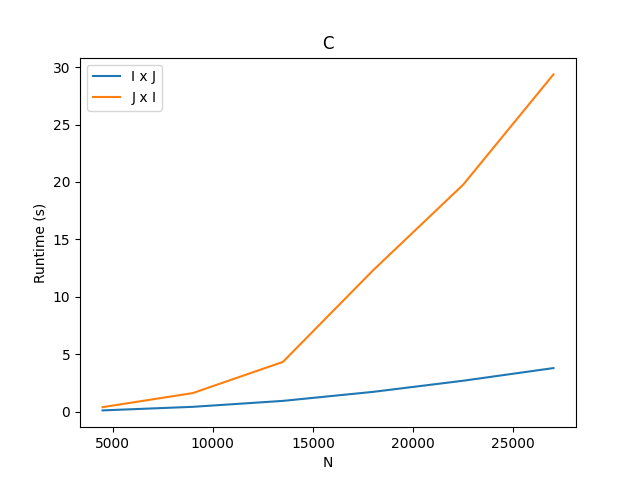
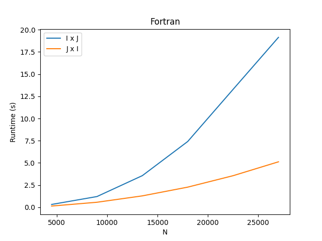

# Exercise 1
This is an exercise for UFRJ's High Performance Computing class. It's goal was to implement a matrix-vector multiplication on C and Fortran, first through a row-column order and then through a column-row order and compare the time it takes.
<table>
  <tr>
    <td>Graph for C</td>
     <td>Graph for Fortran</td>
  </tr>
  <tr>
    <td></td>
    <td></td>
  </tr>
 </table>

## Getting Started

1. Clone the repo:

   ```sh
   git clone https://github.com/carloshenriquefbf/HighPerformanceComputing.git
   ```
2. In order to run exercise 1 make sure you are on the right repository

   ```sh
   cd /HighPerformanceComputing/exercise1
   ```
3. Make the runner script executable

   ```sh
   chmod +x runner.sh
   ```
4. Run the script (it will install the required python libraries through pip so make sure you have that installed)

    ```sh
   ./runner.sh
   ```
The script will plot the time it took for each language to run the matrix vector multiplication. You can check the generated files on the documents folder.
